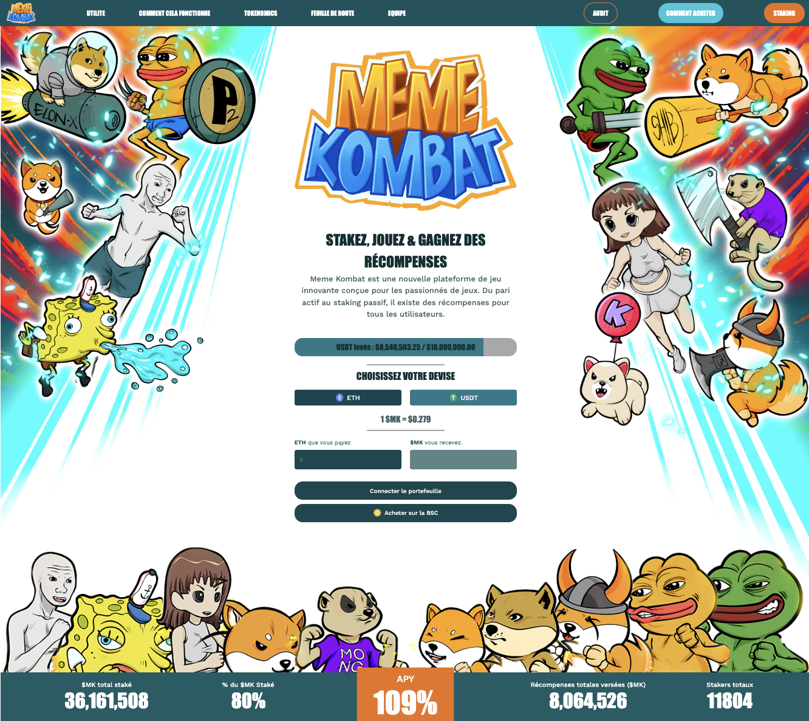

# Reproduction of an ICO Landing Page for the Memekombat Token

This project involves replicating the landing page of an ICO dedicated to the Memekombat token. The aim is to faithfully recreate the user interface of this page to present it in a clear and attractive manner.

# Currency Exchange Functionality

An essential feature of this page is the currency conversion capability. Users will be able to convert different currencies using this feature, enabling them to estimate the value of the Memekombat token in their preferred currency.

# Technologies Used

This project was developed using React JS for client-side logic and Vanilla CSS for styling. This combination of technologies provides a smooth and responsive user experience while offering maximum flexibility for visual design.

